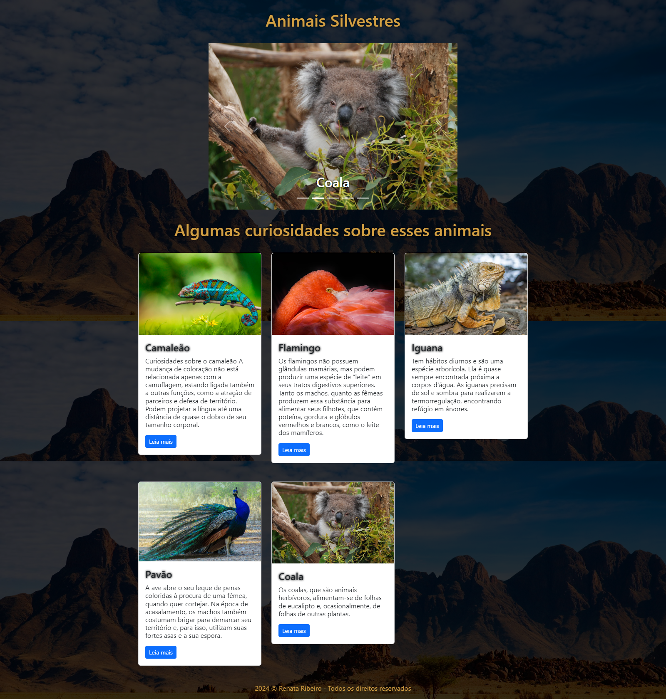
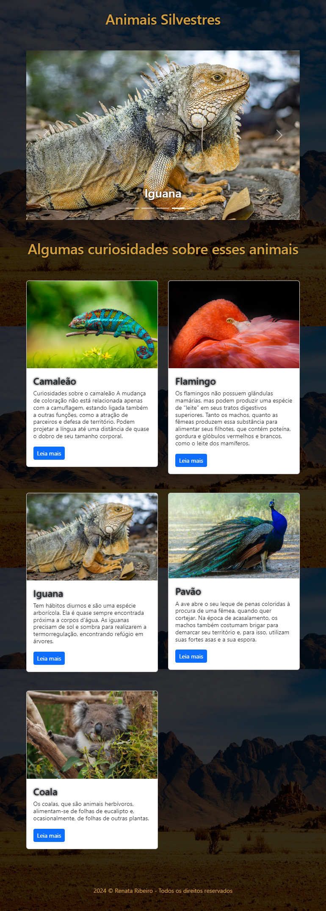
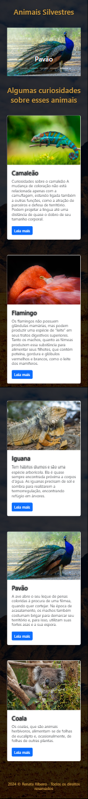

<h1 align="center">Booststrap</h1>

Praticando mais sobre bootstrap, desenvolvi um site com algumas curiosidades de alguns animais silvestrs.

Desenvolvi o carousel e alguns cards com imagens, textos, e botões.

    
 
    

    
 
    

    
 
    
 
<h2 align="center"> Desenvolvido por:
</h2>

<h3 align="center"> Renata Ribeiro 

 

</h3>
  
